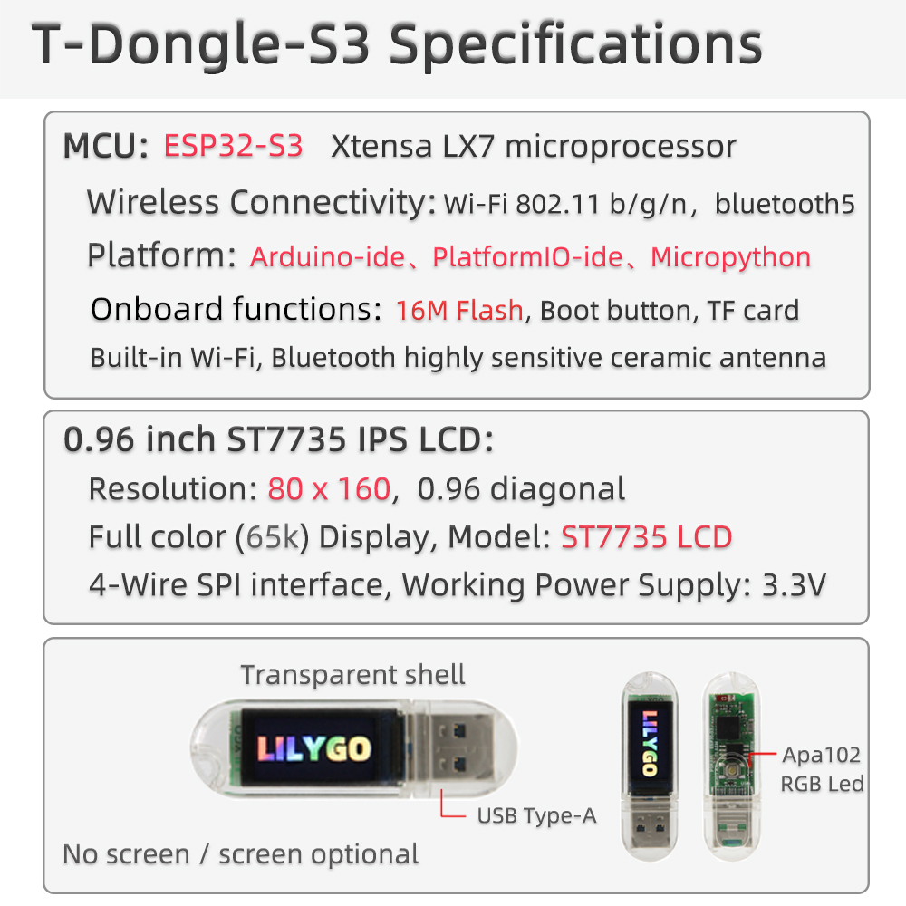
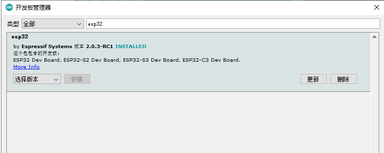
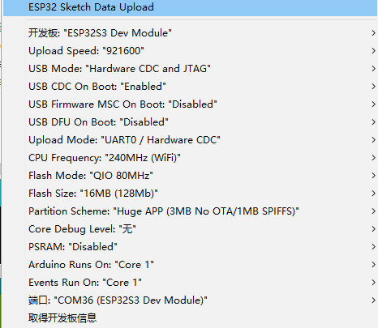

<h1 align = "center">🌟LilyGo T-Dongle-S3🌟</h1>
An ESP32S3 development board that can freely use WIFI, BLE, TF, LED, TFT_LCD functions.

# Introduce

## Product 📷

|  Product |  Product Link |
| :--------: | :---------: |
| T-Dongle-S3 |  [aliexpress](https://www.aliexpress.us/item/1005004860003638.html)   |

# Quick Start
## Arduino 
> Arduino:
>- Click "File" in the upper left corner -> Preferences -> Additional Development >Board Manager URL -> Enter the URL in the input box.
(ESP32S3 is a new chip, and the SDK version needs to be version 2.0.3 or above)
> `https://raw.githubusercontent.com/espressif/arduino-esp32/gh-pages/package_esp32_index.json`
>-  Click OK and the software will be installed by itself. After installation, restart the Arduino IDE software.
>- Search for ESP32 in Tools->Board Manager and install ESP32-Arduino SDK

>- Copy all files in the lib folder to `\Arduino\libraries`
>- Select the settings as shown. Note that the FLASH size partition and size may be modified depending on the board.

> PlatfromIO:
> - PlatformIO plug-in installation: Click on the extension on the left column -> search platformIO -> install the first plug-in
> - Click Platforms -> Embedded -> search Espressif 32 in the input box -> select the corresponding firmware installation

> ESP-IDF:
> - The installation method is also inconsistent depending on the system, it is recommended to refer to the [official manual](https://docs.espressif.com/projects/esp-idf/en/latest/esp32/get-started/index.html) for installation

> Micropython:
> - tft_config.py is already built into the firmware. The examples in the examples directory can be used directly.
> - For detailed function query, please refer to the following link.
> - [[Micropython doc](https://docs.micropython.org/en/latest/index.html)]